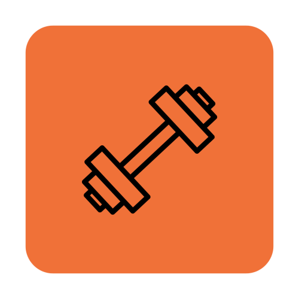

# 🏋️‍♂️ GymRes - Management & Bookings
<div align="center">
  
  
  
  
</div>

<div align="center">
  
</div>

Una aplicación de gestión residencial moderna y eficiente, diseñada para organizar las reservas del gimnasio del edificio con un sistema de prioridades inteligente.

## ✨ Características Principales

- **Sistema de Reservas Inteligente**: Regla preferencial 60/40 para asegurar espacio a inquilinos y propietarios frente a huéspedes.
- **Panel de Administración**: Gestión completa de usuarios, anuncios, reservas en vivo y estadísticas de ocupación.
- **Autenticación Segura**: Integración con Supabase Auth, incluyendo recuperación de contraseña y verificación de email.
- **Gestión de Anuncios**: Carrusel dinámico en el dashboard para comunicar avisos importantes a los residentes.
- **Perfil de Usuario**: Sincronización en tiempo real de datos personales y visualización de historial de reservas.
- **Diseño Premium**: Interfaz oscura (Dark Mode), responsiva y con micro-animaciones fluidas.

## 🛠️ Tech Stack

- **Next.js 15** (App Router)
- **React 19** (Context API, Hooks)
- **Supabase** (PostgreSQL, Auth, Edge Functions, Storage)
- **Tailwind CSS 4** para un estilizado ultra-rápido
- **Lucide Icons** & **Radix UI** para componentes accesibles
- **Sonner** para notificaciones interactivas

## 🚀 Instalación Local

1. Clona el repositorio:
```bash
git clone https://github.com/estefaniii/GymRes.git
```

2. Instala las dependencias:
```bash
npm install
```

3. Configura tus variables de entorno en .env.local:
```bash
NEXT_PUBLIC_SUPABASE_URL=tu_url_de_supabase
NEXT_PUBLIC_SUPABASE_ANON_KEY=tu_anon_key
```

4. Lanza el servidor de desarrollo:
```bash
npm run dev
```

## 🔍 Código Destacado: Lógica 60/40
El núcleo de la equidad en GymRes reside en su algoritmo de aforo preferencial:
```bash
// Lógica de validación de aforo preferencial (60% Inquilinos / 40% Huéspedes)
export function checkBookingAvailability(slot, role) {
  const total = slot.inquilinos + slot.huespedes;
  
  // Si el aforo está casi lleno (>= 17 personas)
  if (total >= 17) {
    if (role === 'huesped' && slot.huespedes >= 8) {
      return { available: false, reason: "Cupo de huéspedes completo (40%)" };
    }
  }
  
  return total < 20 ? { available: true } : { available: false };
}
```
## 🌟 Vista del Panel de Administración
El administrador tiene control total sobre el ecosistema del gimnasio:

Resumen: Estadísticas rápidas de uso diario.
Usuarios: Verificación y gestión de roles (Inquilino, Propietario, Huésped).
Anuncios: Publicación de avisos con soporte para carga de imágenes WebP.

## 🤝 Contribuciones
Haz un Fork del proyecto
Crea tu rama de función (git checkout -b feature/nueva-mejora)
Haz commit de tus cambios (git commit -m 'Añadir nueva mejora')
Push a la rama (git push origin feature/nueva-mejora)
Abre un Pull Request

## 💖 Apoya el Proyecto
Si esta aplicación te ha ayudado a organizar tu comunidad, considera apoyar el desarrollo continuo:
[](https://paypal.me/estefanniii?country.x=PA&locale.x=es_XC)

⭐ ¡No olvides darle una estrella al repositorio si te gusta GymRes!
